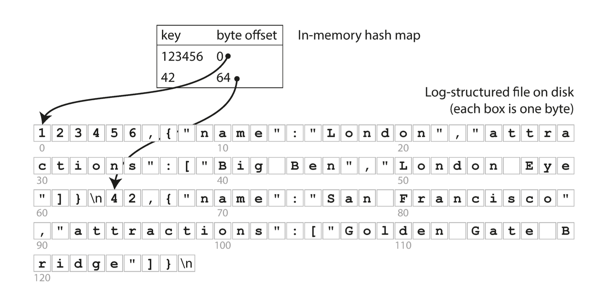
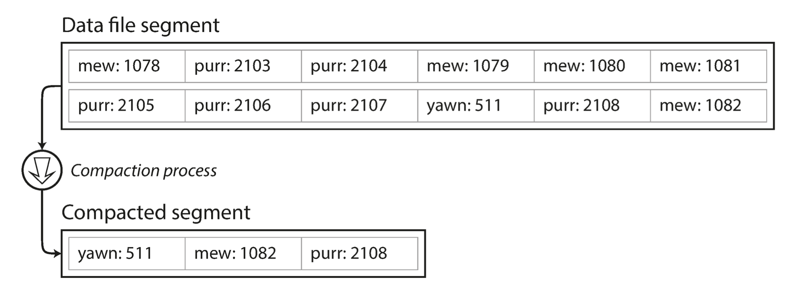
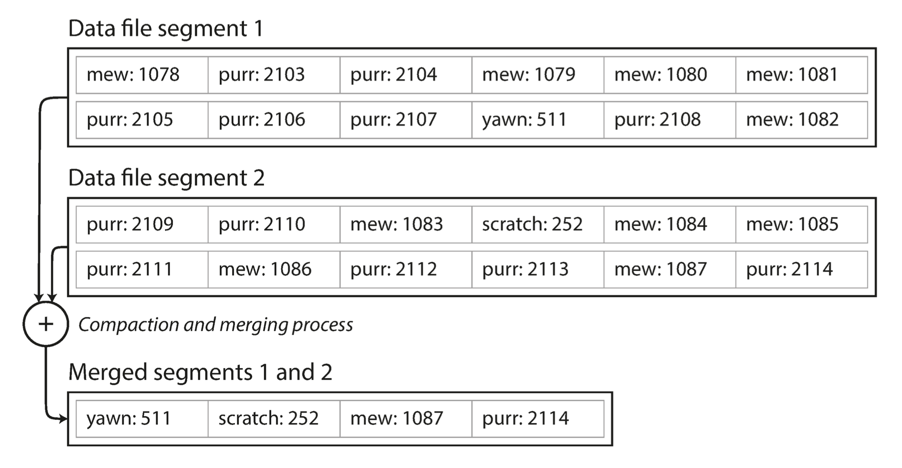

## Indexes

### Hash index

The simplest possible indexing strategy is this: keep an in-memory hash map where every key is mapped to a byte offset
in the data file—the location at which the value can be found, as illustrated. Whenever you append a new
key-value pair to the file, you also update the hash map to reflect the offset of the data you just wrote (this works
both for inserting new keys and for updating existing keys). When you want to look up a value, use the hash map to find
the offset in the data file, seek to that location, and read the value.

Both inserting new key-value and updating exising pair means writing to the end of the file.

As described so far, we only ever append to a file — so how do we avoid eventually running out of disk space? A good
solution is to break the log into segments of a certain size by closing a segment file when it reaches a certain size,
and making subsequent writes to a new segment file. We can then perform compaction on these segments. Compaction means
throwing away duplicate keys in the log, and keeping only the most recent update for
each key.

Moreover, since compaction often makes segments much smaller (assuming that a key is overwritten several times on
average within one segment), we can also merge several segments together at the same time as performing the compaction.
Segments are never modified after they have been written, so the merged segment is written to a
new file. The merging and compaction of frozen segments can be done in a background thread, and while it is going on,
we can still continue to serve read and write requests as normal, using the old segment files. After the merging
process is complete, we switch read requests to using the new merged segment instead of the old segments—and then the
old segment files can simply be deleted.

Each segment now has its own in-memory hash table, mapping keys to file offsets. In order to find the value for a key,
we first check the most recent segment’s hash map; if the key is not present we check the second-most-recent segment,
and so on. The merging process keeps the number of segments small, so lookups don’t need to check many hash maps.

#### Problems

* File format - CSV is not the best format for a log. It’s faster and simpler to use a binary format that first encodes
  the length of a string in bytes, followed by the raw string (without need for escaping).
* Deleting records - If you want to delete a key and its associated value, you have to append a special deletion record
  to the data file (sometimes called a tombstone). When log segments are merged, the tombstone tells the merging process
  to discard any previous values for the deleted key.
* Crash recovery - If the database is restarted, the in-memory hash maps are lost. In principle, you can restore each
  segment’s hash map by reading the entire segment file from beginning to end and noting the offset of the most recent
  value for every key as you go along. However, that might take a long time if the segment files are large, which would
  make server restarts painful.
* Partially written records - The database may crash at any time, including halfway through appending a record to the
  log. Bitcask files include checksums, allowing such corrupted parts of the log to be detected and ignored.
* Concurrency control - As writes are appended to the log in a strictly sequential order, a common implementation choice
  is to have only one writer thread. Data file segments are append-only and otherwise immutable, so they can be read
  concurrently by multiple threads.
