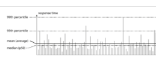

### Design data-intensive applications

#### Reliability

The system should continue to work correctly (performing the correct function at the desired level of performance) even
in the face of adversity (hardware or soft‐ ware faults, and even human error).

* The application performs the function that the user expected.
* It can tolerate the user making mistakes or using the software in unexpected ways.
* Its performance is good enough for the required use case, under the expected load and data volume.
* The system prevents any unauthorized access and abuse.

#### Scalability

As the system grows (in data volume, traffic volume, or complexity), there should be reasonable ways of dealing with
that growth.

Latency and response time are often used synonymously, but they are not the same. The response time is what the client
sees: besides the actual time to process the request (the service time), it includes network delays and queueing delays.
Latency is the duration that a request is waiting to be handled—during which it is latent, awaiting service

#### Maintainability

Over time, many different people will work on the system (engineering and operations, both maintaining current
behavior and adapting the system to new use cases), and they should all be able to work on it productively.

* Operability - Make it easy for operations teams to keep the system running smoothly.
* Simplicity - Make it easy for new engineers to understand the system, by removing as much complexity as possible from
  the system. (Note this is not the same as simplicity of the user interface.)
* Evolvability - Make it easy for engineers to make changes to the system in the future, adapting it for unanticipated
  use cases as requirements change. Also known as extensibility, modifiability, or plasticity.
