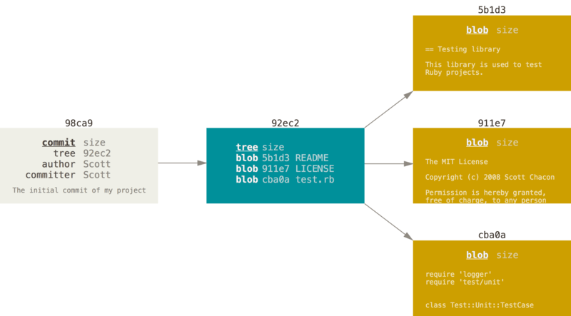
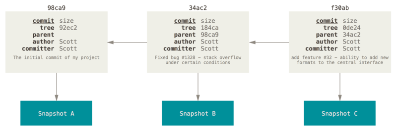

# Git

Version control system. Files exist in three states: _committed_, _modified_, and _staged_.

## Commit

Inside a commit there is the following tree:



Each commit has a reference to the previous one. Commit history is a **singly linked list**.



## Branch

A branch is a pointer to a commit. It is a file containing the 40-character SHA-1 checksum of the commit it points to.
Creating a new branch is writing 41 bytes to a file (40 characters + newline).

### HEAD

Git stores a `HEAD` pointer to the commit the user is currently on. If a new commit is added to the current branch, `HEAD`
moves to it together with the branch pointer. The `checkout` command moves `HEAD` to another commit.

### `.gitignore`

A file describing which parts of the repository to ignore. You can use `glob` patterns.

## Commands

Git commands fall into two types. _git pull_, _git rebase_, and _git clone_ are used frequently; others less often.

### `git diff`

Shows unstaged changes.

#### `git diff --staged` (`--cached`)

Shows what will go into the next commit.

### `git log`

Information about commits, dates, and authors.

#### `git log`

Commit history, starting from the newest.

##### `git log -p -n`

Shows changes from the last `n` commits.

##### `git log --stat`

Shows file change statistics for the last commits (how many lines were added/removed).

##### `git log <branch1>..<branch2>`

Shows commits that are in `branch2` but not in `branch1`. Convenient for seeing what hasn’t yet been merged from a feature
branch into the main branch.

###### `git log origin/develop HEAD`

Shows which commits will be pushed to the remote repository on the next `git push`.

### `git reflog`

Reference “log”: history of where `HEAD` and branches pointed.

#### `git reflog`

Shows the history of `HEAD` moves. Includes rebases and merges.

### `git checkout`

Moves `HEAD` to a branch, commit, or action.

#### `git checkout HEAD@{<number>}`

Moves `HEAD` to the local action with the given `number` from the local “log”. See [Reflog](#git-reflog).

### Remote branches

Operations with branches in a remote repository.

#### `git remote show`

Shows a list of remotes, and for each remote shows which branches exist on the server and locally, and the commit
differences between them.

### Tags

Tags can be **lightweight** or **annotated**. Annotated tags contain information about the author, date, and a message.

#### `git tag`

Shows all available tags (can be filtered).

##### `git tag <name>`

Creates a lightweight tag.

##### `git tag -a <name> -m "<Message>"`

Creates an annotated tag.

##### `git push origin <name>`

Push a tag to the server.

### Aliases

You can define shortcuts (aliases) for frequently used commands.

##### `git config --global alias.<short-name> <default-name>`

Example: `git config --global alias.cm commit`. If you replace multiple commands, wrap them in single quotes.

### Merge

Merge behaves differently depending on the situation:

- **Linear history**: merge from the current pointer to the last commit in the branch. Git will use `--fast-forward` and
  move the current pointer to the end of the branch.
- **Diverged history**: Git performs a three-way merge by finding the common ancestor. Changes from both branches are added
  into a new **merge commit**.

##### Merge conflict

When both branches modify the same parts of the same code, you must resolve conflicts manually.

```html
<<<<<<< HEAD:index.html <!-- HEAD points to the branch into which you merge -->
<div id="footer">contact : email.support@github.com</div>
======= <!-- Separator between conflict sections -->
<div id="footer">
 please contact us at support@github.com
</div>
>>>>>>> iss53:index.html <!-- The branch being merged in -->
```

You can edit the problematic sections manually; IDEs like IntelliJ IDEA can help.

### Rebase

Rebase takes the common ancestor commit; then commit “deltas” after that are applied one by one onto the last commit of
the current branch. If there are no conflicts, the commit sequences in both branches will line up; otherwise the commits
will differ where conflicts were resolved.

### Branch tracking

You can set an upstream tracking branch with **-u**: `git branch -u origin/<name>` (`--set-upstream`).

### `git fetch`

Downloads changes from the remote repository but does not change your working directory. This lets you perform a merge
manually.

### `git pull`

Runs `git fetch` and then `git merge`.

##### `git pull -r` (`--rebase`)

Runs `git fetch` and then `git rebase` instead of merge, producing a cleaner history.

## General

### Commit uniqueness

Each commit has a unique SHA-1 ID (40 hex characters / 20 bytes). In most cases fewer than 20 characters are enough to
identify a commit. Minimum is often 7; if your repo is large and collisions occur, Git will require more characters.

### Special symbols

Git uses:

#### `^`

Parent pointer. Can be added to a commit hash (`sh24fa2^`) or to a ref (`develop^`, `HEAD^`). If there are multiple
parents (merge commits), you can specify the parent number: `^2`, `^3`, etc.

#### `~`

Also a parent pointer, but `~2` means “the parent of the parent”. `~5` means “5 commits back”.

## Hierarchical repositories

Git supports composing repositories.

### Git submodules

This structure lets you include **links** to other repositories. For example, repo **A** has submodule **B**. When you
`git push` in repo B, repo A does not change. To bring changes from B into A, you must run `git submodule update` in A.
Essentially, a submodule is a pointer to a specific commit in another repo.

### Git subtree

Unlike submodules, this includes the other repo fully, **as a copy** (with its history). Changes inside the copied repo
are immediately available, but the overall repository size increases by the size of the subtree.


