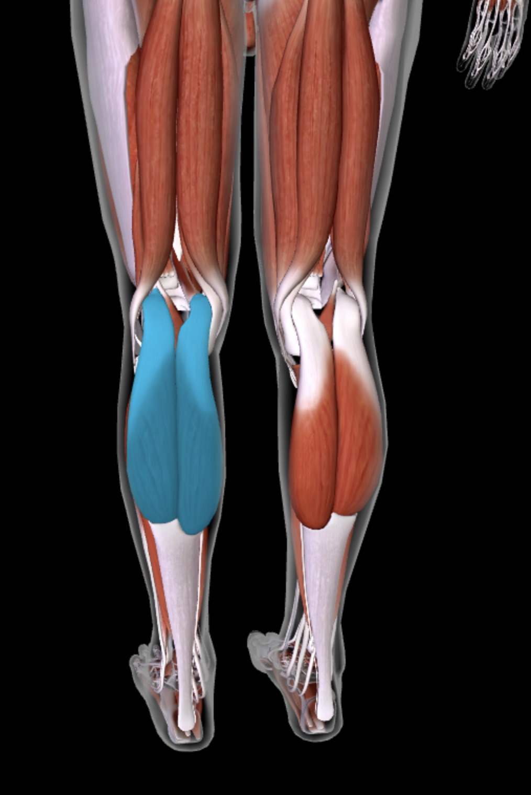
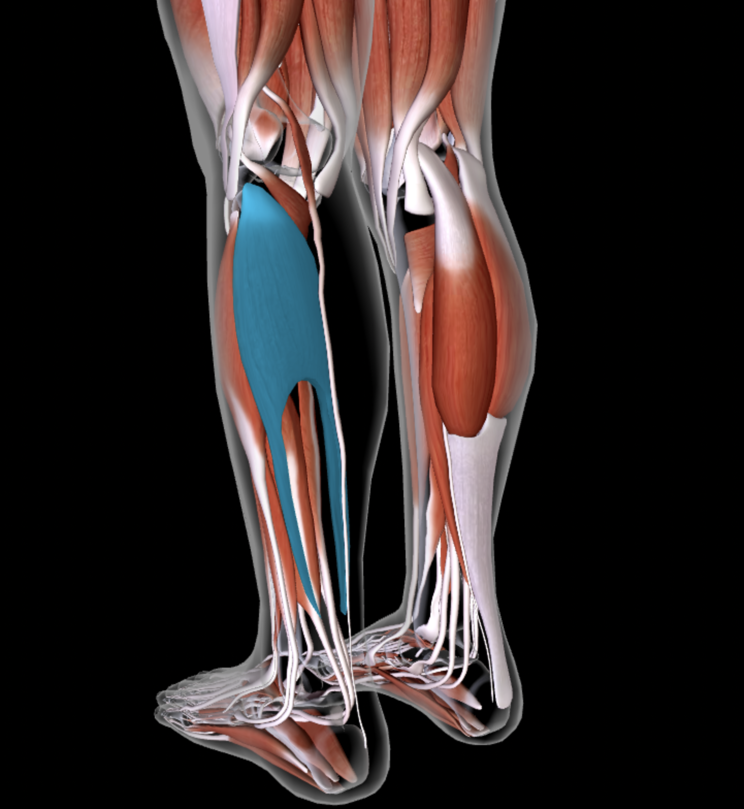
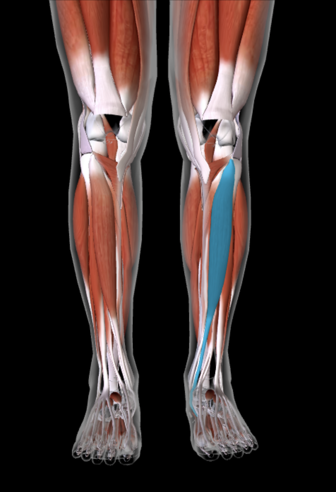
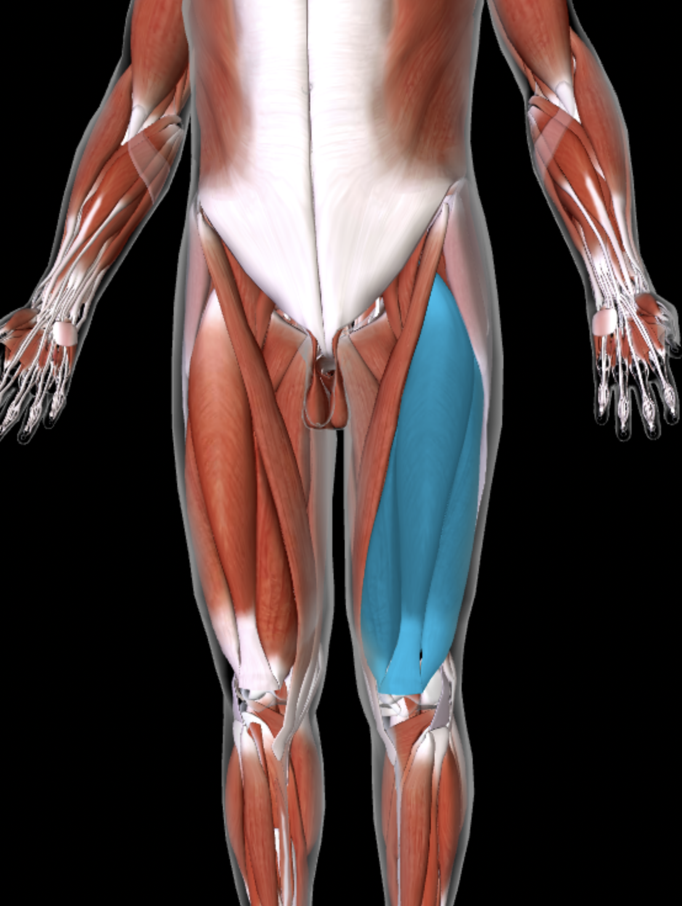
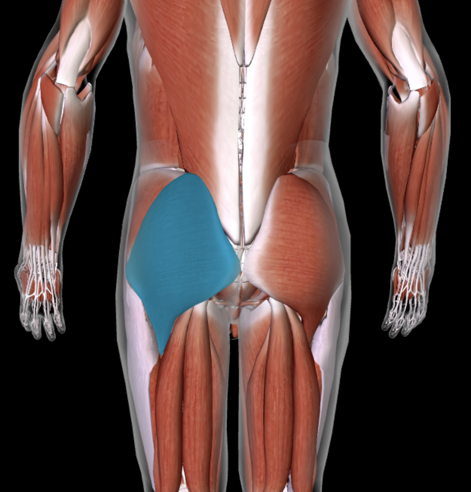
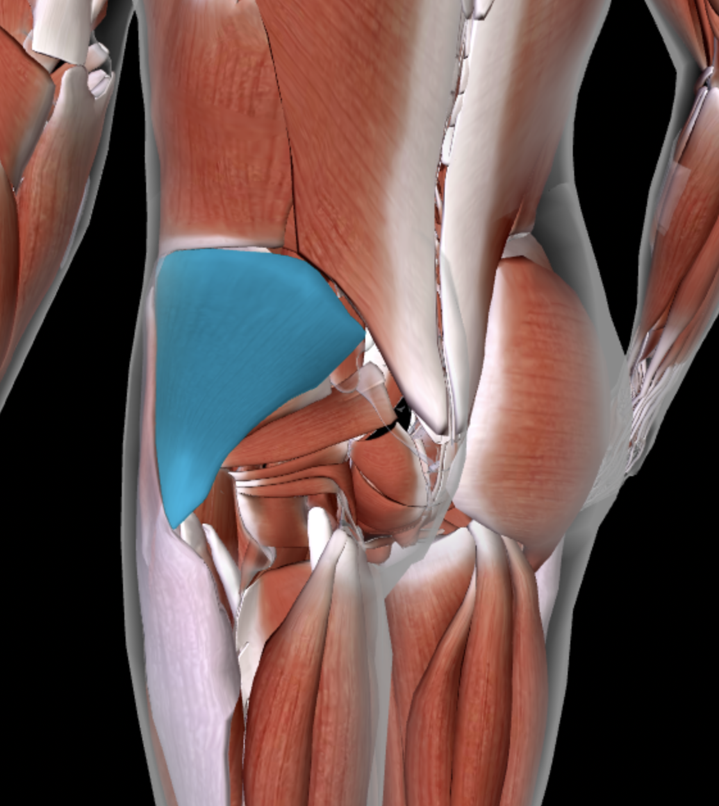
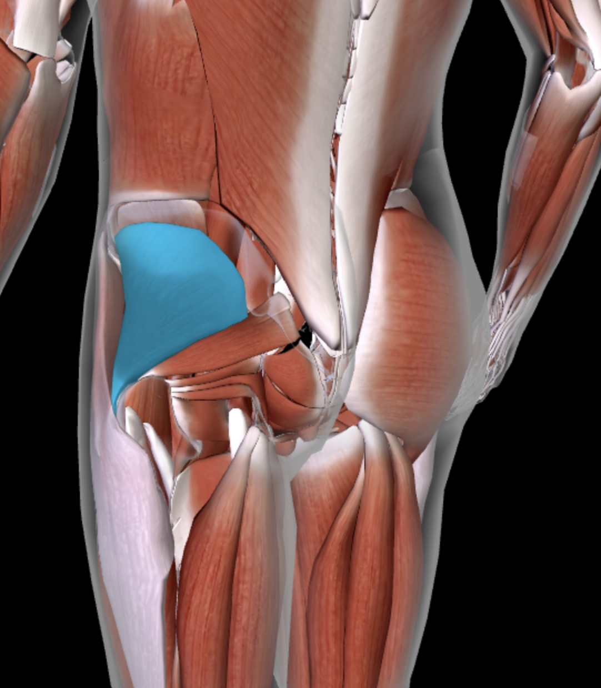

# Trail Running Muscles Guide

This file explains which muscles matter most for trail running, why they matter, and where to train them in this `strength/` folder.

For weekly scheduling and phase-specific sets/reps, see `../technique/06-strength-and-mobility.md` and files in `../progression/`.

## Calves and lower leg

### Gastrocnemius (upper calf)
- **Why important:** propulsion on climbs, impact absorption on descents, Achilles tendon load tolerance.
- **Train with:**
  - [Calf Raises (straight knee, standing)](calves/calf-raises.md)

### Soleus (deep calf)
Under the gastrocnemius.
- **Why important:** endurance support during long runs, especially on sustained uphill grades with bent knee mechanics.
- **Train with:**
  - [Seated Calf Raise (bent knee, soleus)](calves/seated-calf-raise-bent-knee.md)

### Tibialis anterior (front of shin)
- **Why important:** foot lift and controlled foot strike; helps reduce shin splint risk and improve ankle control.
- **Train with:**
  - [Tibialis Raise](calves/tibialis-raise.md)

### Ankle stabilizers (peroneals + tibialis posterior + tibialis anterior)
- **Why important:** balance and fast micro-corrections on uneven terrain; helps reduce ankle sprain risk.
- **Train with:**
  - [Single-Leg Balance](calves/single-leg-balance.md)

## Quads (front thigh)

### Quadriceps (especially eccentric strength)
- **Why important:** primary downhill brake system; controls knee load during descents.
- **Train with:**
  - [Step-Down](lower-body/step-down.md)
  - [Bulgarian Split Squat](lower-body/bulgarian-split-squat.md)
  - [Wall Sit Eccentric](lower-body/wall-sit-eccentric.md)
  - [Single-Leg Squat](lower-body/single-leg-squat.md)

## Glutes and hips

### Gluteus maximus (hip extension power)
- **Why important:** uphill drive, stride power, and hip extension efficiency.
- **Train with:**
  - [Hip Thrust / Glute Bridge](lower-body/hip-thrust-glute-bridge.md)
  - [Single-Leg Squat](lower-body/single-leg-squat.md)
  - [Bulgarian Split Squat](lower-body/bulgarian-split-squat.md)

### Gluteus medius/minimus (lateral hip stability)
Under the gluteus maximus, minimus is the lower of the two.
- **Why important:** controls knee tracking and pelvic stability; key for IT band and knee pain prevention.
- **Train with:**
  - [Clamshells](lower-body/clamshells.md)
  - [Lateral Band Walks](lower-body/lateral-band-walks.md)
  - [Single-Leg Squat](lower-body/single-leg-squat.md)

### Deep hip stabilizers and rotators
- **Why important:** joint control during technical terrain and directional changes.
- **Train with:**
  - [Single-Leg Squat](lower-body/single-leg-squat.md)
  - [Clamshells](lower-body/clamshells.md)
  - [Single-Leg Balance](calves/single-leg-balance.md)

## Posterior chain (back side)

### Hamstrings
- **Why important:** hip extension support and stride control, especially when fatigued.
- **Train with:**
  - [Hip Thrust / Glute Bridge](lower-body/hip-thrust-glute-bridge.md)
  - [Bird Dog](core/bird-dog.md)
  - [Single-Leg Squat](lower-body/single-leg-squat.md)

## Core and trunk

### Deep core (anti-extension and anti-rotation)
- **Why important:** stable trunk improves force transfer and running economy on uneven terrain.
- **Train with:**
  - [Dead Bug](core/dead-bug.md)
  - [Bird Dog](core/bird-dog.md)
  - [Plank](core/plank.md)

### Obliques and lateral core
- **Why important:** side-to-side control and rotational stability on trails.
- **Train with:**
  - [Side Plank](core/side-plank.md)
  - [Bird Dog](core/bird-dog.md)

## Mobility muscles and joints (daily support)

These do not replace strength work. They preserve range of motion and movement quality so strength and running mechanics can be used effectively.

### Hip flexors
- **Why important:** trail running keeps hips flexed for long periods; mobility helps stride mechanics and lower back comfort.
- **Train with:**
  - [Hip Flexor Stretch](mobility/hip-flexor-stretch.md)

### Calf complex and Achilles range
- **Why important:** keeps ankle and tendon movement available for climbs and descents.
- **Train with:**
  - [Calf Stretch](mobility/calf-stretch.md)

### Ankle dorsiflexion system
- **Why important:** affects knee tracking, uphill mechanics, and landing control.
- **Train with:**
  - [Ankle Dorsiflexion](mobility/ankle-dorsiflexion.md)

### Hamstring mobility
- **Why important:** supports stride and reduces compensatory lower back loading.
- **Train with:**
  - [Hamstring Stretch](mobility/hamstring-stretch.md)

### Lateral hip / figure-4 chain
- **Why important:** supports hip comfort and rotational freedom under repetitive load.
- **Train with:**
  - [Figure-4 / IT Band](mobility/figure-4-it-band.md)

### Thoracic spine rotation
- **Why important:** improves arm swing mechanics and upper-body control on technical terrain.
- **Train with:**
  - [Thoracic Rotation](mobility/thoracic-rotation.md)
