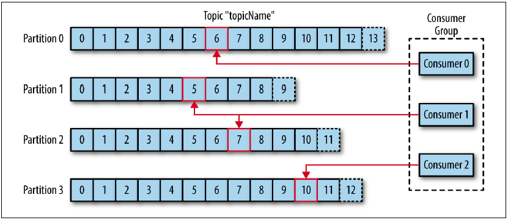
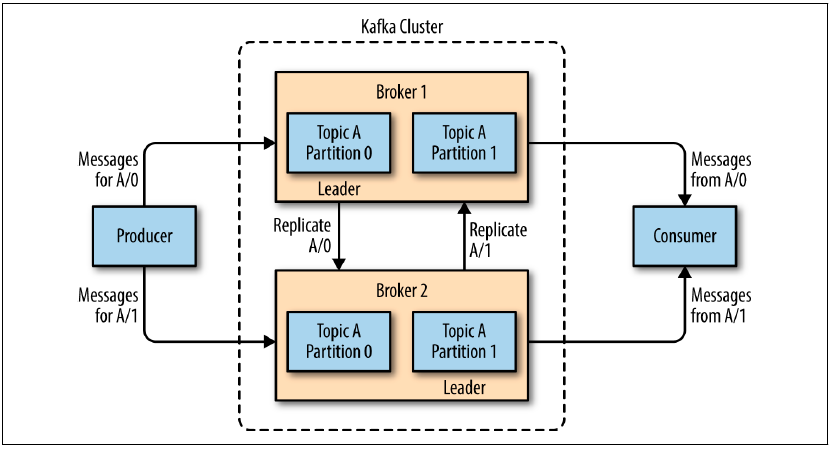

### Apache Kafka

Distributed event streaming platform.

**Message** - unit of data, analog or row or record. Binary, no special format.\
**Key** - optional bit of metadata.\
The simplest such scheme is to generate a consistent hash of the key, and then select the partition number for that
message by taking the result of the hash modulo, the total number of partitions in the topic.\
**Batch** - collection of messages.\
**Topic** - collection of messages into "folder"\
**Partition** - part of topic. Partitions are also the way that Kafka provides redundancy and scalability. Each
partition can be hosted on a different server, which means that a single topic can be scaled horizontally across
multiple servers to provide performance far beyond the ability of a single server.
Topic typically has multiple partitions, there is no guarantee of message time-ordering across the entire topic, just
within a single partition.\
**Stream** - stream of data moving from the producers to the consumers.\
**Offset** - an integer value that continually increases — that Kafka adds to each message as it is produced.\
Consumers aggregates into **Consumers group**. The group assures that each partition is only consumed by one member.

**Broker** - a single Kafka server. The broker receives messages from producers, assigns offsets to them, and commits
the messages to storage on disk. It also services consumers, responding to fetch requests for partitions and responding
with the messages that have been committed to disk.
Kafka brokers are designed to operate as part of a **cluster**. Within a cluster of brokers, one broker will also
function as the **cluster controller** (elected automatically from the live members of the cluster).

A key feature of Apache Kafka is that of retention, which is the durable storage of messages for some period of time.

Pros:

- Multiple Producers - Kafka is able to seamlessly handle multiple producers, whether those clients are using many
  topics or the same topic.
- Multiple Consumers - Multiple Kafka consumers can choose to operate as part of a group and share a stream, assuring
  that the entire group processes a given message only once.
- Disk-Based Retention - Durable retention means that if a consumer falls behind, either due to slow processing or a
  burst in traffic, there is no danger of losing data. It also means that maintenance can be performed on consumers,
  taking applications offline for a short period of time, with no concern about messages backing up on the producer or
  getting lost.
- Scalable
- High Performance
