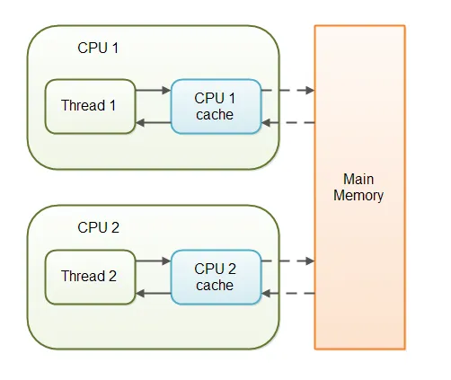

Most modern processors write requests that won’t be applied right after they’re issued. Processors tend to queue those
writes in a special write buffer. After a while, they’ll apply those writes to the main memory all at once.

With all that being said, when the main thread updates the number and ready variables, there’s no guarantee about what
the reader thread may see. In other words, the reader thread may immediately see the updated value, with some delay, or
never at all.

Every thread that accesses a volatile variable will read it from main memory, and not from the CPU cache. This way, all
threads see the same value for the volatile variable.

The volatile keyword is often used with flags that indicate that a thread needs to stop running.

