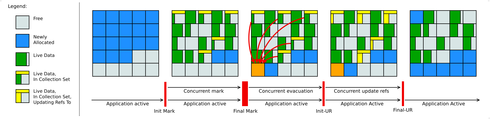

### Garbage collector (GC)

Two phases of work:

- Mark - add label to objects without any link on it or weak link
- Sweep - remove "marked" objects

Pros:
Automatic GC, almost no memory leak, no Dangling (Wild) pointer

Dangling (Wild) pointer - pointer, refers to object, continue to point to empty memory block after removing related
object.

Cons:
CPU, slowdowns, application pauses, not so efficient as manual, no control.

#### Serial GC

Single-thread GC makes application pauses.

#### Parallel GC

Parallel GC makes Mark phase in parallel, but Sweep with freeze all threads.
Default for from Java 5 to 8.
Maximum pause could be controlled with MaxGCPauseMillis parameter.

#### Garbage First G1 GC

Parallel GC, default for Java from 9 to 21.
GC split heap into equal-size regions. After performing Mark phase, it determines which regions are mostly empty and
runs
Sweep there. As a result - more free space easily.

#### Z GC (low latency)

Z takes all from parallel GC, but doesn't stop application more than 10ms. It uses load barriers with colored pointers
to
perform concurrent operations. Color pointer - additional metadata for link to object to highlight its state.
From Java 15. From Java 21 supports separate generations of young objects which allow to collect them more frequently.

* Pause times should not exceed 1 millisecond,
* Heap sizes from a few hundred megabytes up to many terabytes should be supported, and
* Minimal manual configuration should be needed.

As examples of the last point, there should be no need to manually configure

* The size of the generations,
* The number of threads used by the garbage collector, or
* For how long objects should reside in the young generation.

Finally, Generational ZGC should be a better solution for most use cases than non-generational ZGC. We should eventually
be able to replace the latter with the former in order to reduce long-term maintenance costs.

#### Shenandoah GC

Parallel GC, reduces pause times by performing more GC work concurrently with working application. It's regionalized
collector, it maintains the heap as the collection of regions.
Java 8, 11, 17.

