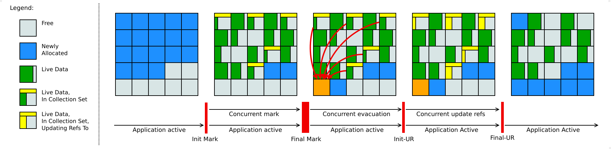

### Garbage collector (GC)

Two phases of work:

- Mark - add label to objects without any link on it or weak link
- Sweep - remove "marked" objects

Status note (end of 2025):
- JVM GC behavior and defaults can vary by **JDK version** and sometimes by **vendor/build**. The notes below are aligned to OpenJDK/HotSpot and are timestamped where relevant.

Pros:
Automatic GC, almost no memory leak, no Dangling (Wild) pointer

Dangling (Wild) pointer - pointer, refers to object, continue to point to empty memory block after removing related
object.

Cons:
CPU, slowdowns, application pauses, not so efficient as manual, no control.

#### Serial GC

Single-thread GC makes application pauses.

#### Parallel GC

Parallel GC makes Mark phase in parallel, but Sweep with freeze all threads.
Default for from Java 5 to 8.
Maximum pause could be controlled with MaxGCPauseMillis parameter.

#### Garbage First G1 GC

Region-based collector. **Default GC for HotSpot server configurations since JDK 9**.
GC split heap into equal-size regions. After performing Mark phase, it determines which regions are mostly empty and
runs
Sweep there. As a result - more free space easily.

#### Z GC (low latency)

ZGC is a concurrent, region-based, compacting collector designed for low latency. It uses load barriers and pointer metadata
to perform many GC operations concurrently with application threads.

- Introduced as **experimental** in JDK 11.
- Became a **product feature** in JDK 15 (no longer requires `-XX:+UnlockExperimentalVMOptions`).
- **Generational ZGC** was delivered in JDK 21 (young + old generations). Initially it is enabled by adding `-XX:+ZGenerational`
  when using `-XX:+UseZGC`. (Defaults can change in later releases; always verify for the JDK you run.)

* Pause times should not exceed 1 millisecond,
* Heap sizes from a few hundred megabytes up to many terabytes should be supported, and
* Minimal manual configuration should be needed.

As examples of the last point, there should be no need to manually configure

* The size of the generations,
* The number of threads used by the garbage collector, or
* For how long objects should reside in the young generation.

Finally, Generational ZGC should be a better solution for most use cases than non-generational ZGC. We should eventually
be able to replace the latter with the former in order to reduce long-term maintenance costs.

#### Shenandoah GC

Shenandoah reduces pause times by doing evacuation (moving objects) concurrently with running Java threads.
It is **experimental** in OpenJDK (requires `-XX:+UnlockExperimentalVMOptions -XX:+UseShenandoahGC`), and has historically
been shipped and supported in downstream builds (e.g., Red Hat distributions / backports for older JDK lines).

---

#### References (authoritative)

- G1 default for server configurations (JDK 9): `https://openjdk.org/jeps/248`
- ZGC experimental (JDK 11): `https://openjdk.org/jeps/333`
- ZGC product feature (JDK 15): `https://openjdk.org/jeps/377`
- Generational ZGC (JDK 21): `https://openjdk.org/jeps/439`
- Shenandoah experimental in OpenJDK (JDK 12): `https://openjdk.org/jeps/189`
